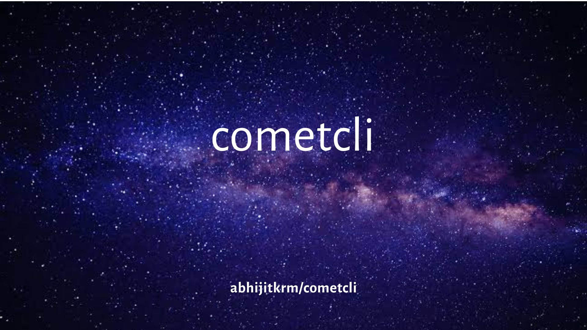

<div align="center">
  
  <h1>cometcli</h1>
  <p><b>An agentic SRE terminal for Cosmos-EVM validators</b></p>
</div>

<div align="center">
  <a href="https://github.com/abhijitkrm/cometcli/actions/workflows/ci.yml">
    
  </a>
  <a href="https://github.com/abhijitkrm/cometcli/releases">
    
  </a>
  <a href="https://github.com/abhijitkrm/cometcli/blob/main/LICENSE">
    
  </a>
  <a href="https://goreportcard.com/report/github.com/abhijitkrm/cometcli">
    
  </a>
  <a href="https://pkg.go.dev/github.com/abhijitkrm/cometcli">
    
  </a>
</div>

<br/>

cometcli is a local-first operations terminal for validators running
[Cosmos-EVM](https://github.com/cosmos/evm) chains. It answers
*"is my node healthy?"* — and lets you act on the answer — from one place.

- **Observe** — CometBFT RPC, Cosmos gRPC, and EVM JSON-RPC in one view:
  signing health, peers, drift, gov, upgrade plans
- **Operate** — transactions (simulate → decode → approve → broadcast),
  service control, upgrades, state-sync, security audits
- **Watch** — live TUI dashboard and an alert engine that pages you on
  Slack, Discord, or Telegram
- **Automate** — runbooks for jail recovery, halts, migrations; the same
  tools drive an optional AI agent

No dashboards to wire up. No context-switching between `evmd`, `systemctl`,
`curl`, and explorer tabs.

Every capability is a deterministic subcommand **and** a tool the optional AI
agent can call — one registry, two front-ends. The deterministic layer is
boring and correct; the agent composes it. See [PLAN.md](PLAN.md) for the
architecture and design rationale.

## Install

```bash
# one-liner: downloads the latest signed release, verifies sha256
curl -fsSL https://raw.githubusercontent.com/abhijitkrm/cometcli/main/scripts/install.sh | bash

# or from source (Go 1.25+)
go install github.com/abhijitkrm/cometcli/cmd/cometcli@latest
```

Details — custom install dirs, checksum/cosign verification, SBOMs — in
[docs/INSTALL.md](docs/INSTALL.md).

## Quick start

```bash
# 1. Guided setup — probes your node and fills in chain-id, bech32 prefix,
#    bond denom, and evm-chain-id automatically
cometcli init

# (or declaratively — `profile add` merges, re-run to update one field)
cometcli profile add myval \
  --chain-id mychain-1 --evm-chain-id 9000 --bech32-prefix cosmos \
  --role validator --home /var/lib/evmd --binary evmd \
  --comet tcp://127.0.0.1:26657 --grpc 127.0.0.1:9090 \
  --evm http://127.0.0.1:8545 \
  --service systemd --unit evmd.service \
  --signer ops --signer-backend file --fee-denom uatom

# 2. Add an ops key (transaction signing only — consensus keys are never touched)
cometcli keys add --name ops                       # generate
cometcli keys add --name ops --recover             # import BIP-39 mnemonic
cometcli keys add --name ops --privkey-hex <hex>   # import raw secp256k1 hex

# 3. Check everything
cometcli doctor
```

```
✓  rpc reachable      height 4464
✓  not catching up    catching_up=false
✓  has peers          3 peers
✓  port exposure      clean
✗  key file perms     1 problems          ← config dir is 0755, want 0700
✓  signing health     missed 5/10000
✓  jail status        not jailed
✓  upgrade pending    none
✓  host disk
✓  ntp/clock
✓  evm parity         drift 0
```

## Command surface

Tools are grouped by domain. Required args also bind positionally —
`cometcli tx get <hash>` works like `evmd q tx <hash>`.

| Domain | Highlights |
|---|---|
| `node` | `status`, `peers`, `health`, `consensus`, `logs`, `config --action lint`, `service status\|restart`, `version-check` |
| `val` | `status`, `signing`, `rewards`, `votes` · on-chain: `unjail`, `withdraw`, `vote`, `edit`, `create` |
| `chain` | `validators`, `params`, `gov`, `upgrade-plan`, `pool`, `balance` |
| `evm` | `chainid` (profile-vs-RPC sanity), `parity` (comet↔JSON-RPC drift), `gasprice`, `txpool` |
| `tx` | `send`, `delegate`, `undelegate`, `redelegate`, `get` — every tx tool takes `--gas-price`, `--gas-limit`, `--fee-denom`, `--seq` |
| `keys` | `add` (`--recover`/`--privkey-hex`), `list`, `show`, `rm`, `convert` (bech32↔0x) — `eth_secp256k1` by default |
| `sec` | `exposure` (listening-port audit), `perms` (key-file permissions), `doublesign` (priv_validator_state HRS check) |
| `mon` | `snapshot`, `watch` (live TUI), `alerts` (rules → stdout/Slack/Discord/Telegram; `--once`, `--mute`, `--repeat-minutes`) |
| `ui` | full-screen app: overview, fleet matrix, log tail, read-only tool runner |
| `upgrade` | `check` (plan + binary + upstream release), `prepare` (cosmovisor staging), `watch` |
| `snap` | `list`, `prune`, `statesync` (fetch trust height, write `[statesync]`) |
| `runbook` | `list`, `show`, `run` — builtins + your own YAML in `~/.cometcli/runbooks/` |
| `net` | `add-peer`, `rm-peer` (persistent peers in config.toml) |
| `fleet` | `status` (health matrix), `exec` (fan out a read-only tool), `shell` (command on every host, one approval) |
| `agent`/`ask` | interactive AI SRE over the same registry |

Global flags: `--profile` (override active), `--json` (structured output),
`-y/--yes` (auto-approve observe/diagnose prompts — never on-chain).

## Transactions

Every on-chain op goes through **build → simulate → decode → approve →
broadcast → confirm**:

```
⚠  [on-chain] broadcast transaction
{
  "chain_id": "mychain-1",
  "account": "cosmos10pmprk9…",
  "sequence": 1,
  "messages": ["/cosmos.bank.v1beta1.MsgSend {…}"],
  "fee": "155401875000000uatom",
  "gas_limit": 138135
}
Proceed? [y/N]
```

Nothing hits the wire without an explicit `y`. Sync-acceptance is not
success — cometcli polls for the committed result and reports the real
`code`, height, and gas. Sequence drift auto-heals once.

## The agent

`cometcli agent` (or `cometcli ask "why is my validator missing blocks?"`)
runs an LLM in a loop over the same tool registry:

```bash
cometcli profile add myval --agent-provider anthropic --agent-model claude-sonnet-4-5
export ANTHROPIC_API_KEY=…          # or OPENAI_API_KEY, OLLAMA_API_KEY;
                                    # COMETCLI_LLM_API_KEY is a universal fallback
cometcli ask "summarize signing health and flag any exposure risks"
```

Providers: `anthropic`, `openai`, `openai-compat` (Ollama, vLLM, LM Studio —
any OpenAI-shaped endpoint via `--agent-base-url`), or `off`.

The model sees tool calls as function calls; every on-chain or local-change
call still goes through the same approval gate — **the model can propose,
only you approve.**

## Safety model

- **Tiers** — `observe → diagnose → local-change → on-chain`. Read-only by
  default; every mutation prompts.
- **Consensus keys are radioactive** — `priv_validator_key.json` is never
  read into memory or sent to a model. Only `priv_validator_state.json`
  HRS is inspected for double-sign guards.
- **Redaction** — keys, mnemonics, JWTs, bearer tokens, and URL credentials
  are scrubbed from all text entering and leaving the agent.
- **Audit** — every tool call, shell command, prompt, and transaction lands
  in `~/.cometcli/audit/YYYY-MM-DD.jsonl` (`cometcli audit` to tail it).
- **Bounded execution** — every tool runs under a deadline; a dead endpoint
  fails fast instead of hanging.

## Profiles & config

State lives in `~/.cometcli/` (`COMETCLI_HOME` to override):

```
config.yaml     # profiles + active pointer
keys/           # ops keyring (file backend)
runbooks/       # your custom YAML playbooks
audit/          # JSONL audit trail
```

Key env vars: `COMETCLI_PROFILE`, `COMETCLI_KEYRING_PASSWORD`,
`ANTHROPIC_API_KEY`, `OPENAI_API_KEY`, `COMETCLI_LLM_API_KEY`.

## Documentation

- [docs/INSTALL.md](docs/INSTALL.md) — install options, checksum & cosign verification
- [PLAN.md](PLAN.md) — architecture and design rationale
- [docs/RUNBOOKS.md](docs/RUNBOOKS.md) — builtin playbooks + authoring your own
- [docs/TROUBLESHOOTING.md](docs/TROUBLESHOOTING.md) — endpoints, keyrings,
  tx errors, SSH, state sync, agent config
- [docs/RELEASE.md](docs/RELEASE.md) — release checklist and verification
- [CONTRIBUTING.md](CONTRIBUTING.md) · [SECURITY.md](SECURITY.md)

## Development

```bash
go build ./...          # build all packages
go vet ./...            # vet
golangci-lint run       # lint (config: .golangci.yml)
go test ./...           # unit tests (keys KAT, redaction, lint, agent loop…)

# e2e (needs a live node):
COMETCLI_E2E=1 COMETCLI_E2E_GRPC=127.0.0.1:9090 \
COMETCLI_E2E_COMET=tcp://127.0.0.1:26657 go test ./test/e2e/...

# SSH transport e2e (needs a reachable sshd):
COMETCLI_SSH_TEST_HOST=127.0.0.1 COMETCLI_SSH_TEST_PORT=2222 \
COMETCLI_SSH_TEST_USER=ops COMETCLI_SSH_TEST_KEY=~/.ssh/id_ed25519 \
go test ./internal/client/host -run SSHLive -v
```

## Ecosystem

Built for the Cosmos stack — chains running
[CometBFT](https://github.com/cometbft/cometbft) consensus with the
[Cosmos EVM](https://github.com/cosmos/evm) module (`evmd` and derivatives).
If your chain exposes a CometBFT RPC, Cosmos gRPC, and Ethereum JSON-RPC,
cometcli speaks to all three.

**Nothing is chain-specific.** Chain-id, bech32 prefix, fee denom, EVM
chain-id, ports, binary name — all live in the profile, and `cometcli init`
auto-detects most of them by probing the node. Point it at any evmd-based
chain and it just works.

## Contributing

Bug reports and feature requests via
[issues](https://github.com/abhijitkrm/cometcli/issues). See
[CONTRIBUTING.md](CONTRIBUTING.md); security disclosures per
[SECURITY.md](SECURITY.md).

## License

[Apache-2.0](LICENSE)
