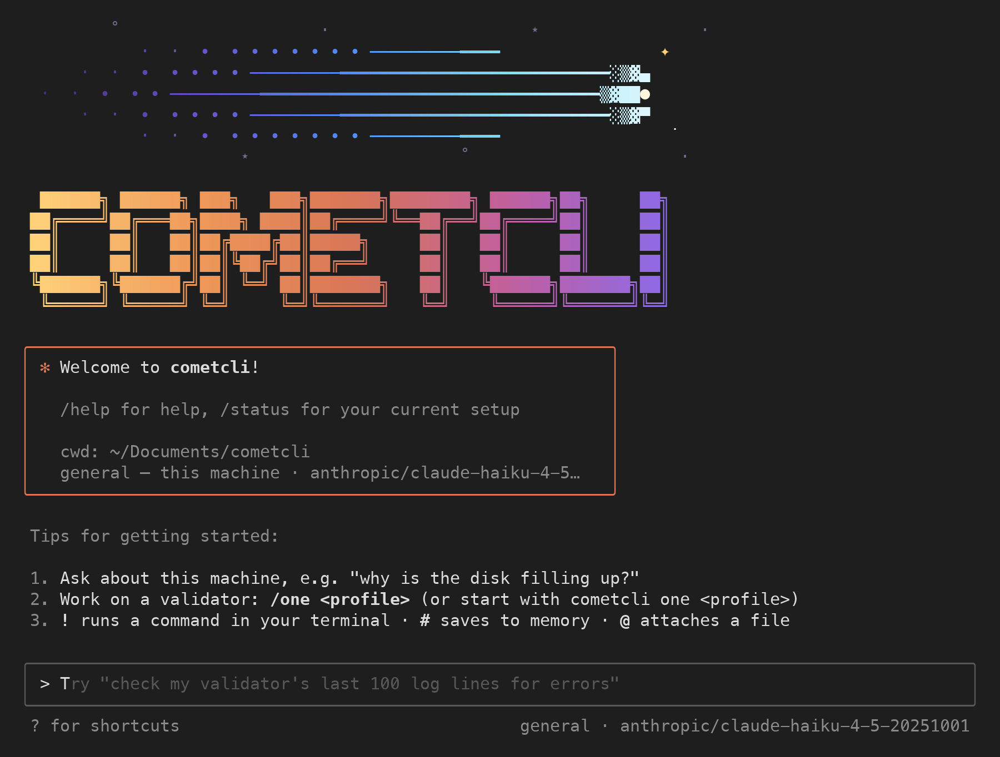

<div align="center">
  
  <h1>cometcli</h1>
  <p><b>An agentic SRE terminal for Cosmos validators</b></p>
</div>

<div align="center">
  <a href="https://github.com/abhijitkrm/cometcli/actions/workflows/ci.yml">
    
  </a>
  <a href="https://github.com/abhijitkrm/cometcli/releases">
    
  </a>
  <a href="https://github.com/abhijitkrm/cometcli/blob/main/LICENSE">
    
  </a>
  <a href="https://goreportcard.com/report/github.com/abhijitkrm/cometcli">
    
  </a>
  <a href="https://pkg.go.dev/github.com/abhijitkrm/cometcli">
    
  </a>
</div>

<br/>

cometcli is an AI terminal you talk to in plain language, built for running
[Cosmos SDK](https://github.com/cosmos/cosmos-sdk) and
[Cosmos-EVM](https://github.com/cosmos/evm) validators. Ask *"is anyone jailed?"* or
*"why is my validator missing blocks?"*. It inspects the node, chain and host, works
out the cause, proposes the fix, and carries it out once you approve.

- **Ask** — plain-language questions about your machine, nodes and chain; it checks
  instead of guessing
- **Diagnose** — one sweep of ~50 signals, matched against a knowledge base of 77
  known failure cases, root cause first
- **Fix** — incidents worked end to end: fix the cause, wait for sync, unjail, check
  it signs again; every change and transaction waits for your approval
- **Operate** — transactions, governance proposals and votes, upgrades, state sync,
  service control, security audits
- **Watch** — live dashboard and alerts to Slack, Discord or Telegram
- **Extend** — settings, memory, custom commands, hooks, MCP servers and subagents

<p align="center">
  
</p>

Every capability is a deterministic subcommand **and** a tool the agent can call —
one registry, two front-ends. The deterministic layer is boring and correct; the
agent composes it. See [PLAN.md](PLAN.md) for the architecture.

## Install

```bash
# one-liner: downloads the latest signed release, verifies sha256
curl -fsSL https://raw.githubusercontent.com/abhijitkrm/cometcli/main/scripts/install.sh | bash

# or from source (Go 1.25+)
go install github.com/abhijitkrm/cometcli/cmd/cometcli@latest
```

Details — custom install dirs, checksum/cosign verification, SBOMs — in
[docs/INSTALL.md](docs/INSTALL.md).

## Quick start

**1. Pick a model** (once). Keys are read hidden and saved to
`~/.cometcli/credentials` (mode 0600); an environment variable of the same name
always wins.

```bash
# low-cost Claude
cometcli config set agent.provider anthropic
cometcli config set agent.model claude-haiku-4-5-20251001
cometcli config set-key ANTHROPIC_API_KEY

# or free models via OpenRouter
cometcli config set agent.provider openrouter     # model defaults to openrouter/free
cometcli config set-key OPENROUTER_API_KEY
```

**2. Talk to it.**

```bash
cometcli                                  # chat on this machine
cometcli "why is the disk filling up?"    # start with a question
```

**3. Add your node** and ask about it — the agent moves onto the node by itself when
a question needs it.

```bash
cometcli init                             # guided: probes the node, fills chain-id, prefix, denoms
cometcli one myval                        # or pin a session to the node
cometcli one myval "is my validator healthy?"
cometcli doctor                           # one-shot health check, no model needed
```

Or add the profile declaratively (`profile add` merges — re-run to change a field):

```bash
cometcli profile add myval \
  --chain-id mychain-1 --bech32-prefix cosmos \
  --role validator --home /var/lib/evmd --binary evmd \
  --comet tcp://127.0.0.1:26657 --grpc 127.0.0.1:9090 \
  --evm http://127.0.0.1:8545 \
  --service systemd --unit evmd.service \
  --signer ops --signer-backend file --fee-denom uatom
```

`--evm` is optional: leave it out for a plain Cosmos SDK chain.

**Remote nodes**: run cometcli on your laptop and reach the node over SSH. Give it an
address or a `~/.ssh/config` alias; the user, key and ProxyJump are read from there.
Host keys are checked against `known_hosts`. The node's localhost-only RPC and gRPC
ports are reached through the SSH connection, so nothing needs opening in the firewall.

```bash
cometcli profile add val01 --ssh-host val01 --service docker --unit validator \
  --comet tcp://127.0.0.1:26657 --grpc 127.0.0.1:9090
cometcli ssh test val01        # trust the host key, check docker/systemd/logs/ports
```

## The terminal

An inline chat: answers land in your normal scrollback, and only
the bottom of the screen redraws.

```
> is anyone jailed?

⏺ Use node(val01)
  ⎿  node mode: val01

⏺ chain.validators(status=jailed)
  ⎿  no validator is jailed

⏺ No — none of mychain-1's validators is jailed.
```

| Key / prefix | Does |
|---|---|
| `/` | command menu — `/incident`, `/status`, `/one`, `/model`, `/cost`, `/compact`, … |
| `@path` · `!cmd` · `#text` | attach a file · run a command in your own terminal · save to memory |
| `esc` | interrupt; anything you typed meanwhile is sent at once |
| `ctrl+r` · `ctrl+o` | expand the last tool output · show the model's thinking |
| `shift+tab` | cycle permission mode: ops → accept-edits → read-only |

Type while it works and your message reaches the model at its next step, so you can
redirect or stop it mid-task. Approvals offer **Yes**, **Yes, and don't ask again**
for that kind of command, and **No**. Full list in
[docs/COMMANDS.md](docs/COMMANDS.md#the-interactive-terminal).

**General mode** (`cometcli`) gives the agent `bash`, file read/write/edit,
`glob`/`grep` and `web_fetch` on your machine. **Node mode** (`cometcli one
<profile>`, `/one <profile>`, or the agent's own `use_node`) adds the node, chain,
validator and incident tools, runs the shell on the node's host (local or SSH), applies
the validator safety rules and keeps a live snapshot of the node in context.

Headless, for scripts and CI:

```bash
cometcli -p "summarize docker container health"
journalctl -u evmd -n 300 | cometcli one myval -p "why did it halt?"
cometcli -p --output-format json "…"            # result + usage as JSON
cometcli -p --output-format stream-json "…"     # one JSON event per line
cometcli -c                                     # continue the last session here
cometcli -r <id>                                # resume one (cometcli sessions)
```

## Incidents

Validators fail in a few hundred known ways. cometcli starts every incident from
evidence: `node.triage` collects ~50 signals at once — sync, peers, signing, jail,
consensus key, upgrade plan, governance, disk, memory, clock, process restarts and
OOM kills, log error categories, config invariants, EVM — and matches them against a
knowledge base of known cases for CometBFT, the Cosmos SDK and Cosmos-EVM.

```
$ cometcli node triage
matched cases (root causes, most severe first):
  1. cfg-parse-error [critical] Config file fails to parse — config.parse_error == true
symptoms of the above (clear once the root is fixed): node-crash-loop, node-rpc-down,
  val-jailed-downtime
→ kb.show <id> for confirm steps, fix and verify; confirm before acting.
```

Each case lists how to confirm it, its causes, fix steps tagged `[read]` /
`[change]` / `[tx]`, how to verify, and what never to do. In a session,
**`/incident [what you see]`** works the top case to resolution: confirm → fix the
root cause → wait (`wait.until`, without spending model calls) → verify → report.
When the agent finds a cause no case covered, it offers to record it with `kb.add`.

cometcli remembers. Every triage is saved to the node's history, so it can tell you what
changed since the last check and answer "since when?" (`node history --since 7d`).
Every finished incident is saved as a postmortem with its root cause, actions,
transaction hashes and a timeline from the audit log. Triage points out when the same
problem comes back.
Add your own cases in `~/.cometcli/kb/` — format in
[docs/EXTENDING.md](docs/EXTENDING.md#knowledge-base-cases).

Across nodes, `cometcli fleet triage` compares them all at once. It points out a node
behind the others, a chain-wide halt, version mismatches, two nodes running one
consensus key, and validators cut off from their sentries. `cometcli watch` does this on
an interval for you. It works new incidents read-only and reports them to Slack,
Discord or Telegram, or with `--mode fix` sends each approval to Telegram with
Approve/Deny buttons. To check how well all of this works, `cometcli drill` breaks a
throwaway local network on purpose and scores whether the agent finds and fixes each
fault.

Jail recovery is careful about fees: `val.unjail` refuses while the jail period runs,
the node isn't synced, the signer's saved state is ahead of the chain, the node signs
with a different consensus key than the one registered, self-delegation is below the
minimum, or the account can't pay the fee. `/recover-jail` runs the whole procedure.

## Transactions and governance

Every on-chain op goes through **build → simulate → decode → approve → broadcast →
confirm**, and always waits for you:

```
⚠  [on-chain] broadcast transaction
{
  "signer": "container val-node (key validator, test keyring)",
  "chain_id": "mychain-1",
  "messages": ["/cosmos.slashing.v1beta1.MsgUnjail {…}"],
  "fee": "130408000000000uatom",
  "gas_limit": 130408
}
Proceed? [y/N]
```

Two signers: cometcli's own keyring, or **the node container's keyring** — the key
never leaves the node; cometcli has `evmd tx sign` run inside the container. When both
can sign, you pick one first. A local key is only offered if it is the validator's
operator account. Sync-acceptance is not success — cometcli polls for the committed
result and reports the real code, height and gas.

Governance: `gov propose` (text, software upgrade, any messages), `gov deposit`,
`val vote`, and `wait until --condition proposal-status`. Upgrade heights the vote
can't reach in time are refused before you sign. See
[docs/COMMANDS.md](docs/COMMANDS.md#governance).

## Command surface

Tools are grouped by domain. Required args also bind positionally —
`cometcli tx get <hash>` works like `evmd q tx <hash>`.

| Domain | Highlights |
|---|---|
| `node` | `triage`, `history`, `status`, `peers`, `health`, `consensus`, `logs`, `config --action lint`, `service status\|restart`, `version-check` |
| `val` | `status`, `signing`, `jail-check`, `consensus`, `rewards`, `votes` · on-chain: `unjail`, `withdraw`, `vote`, `edit`, `create` |
| `chain` | `validators` (`--status jailed`), `params`, `gov`, `upgrade-plan`, `pool`, `balance` |
| `gov` | `propose` (text / upgrade / messages), `deposit` |
| `incident` | `list`, `show`, `record` — postmortems of past incidents |
| `kb` | `search`, `show`, `add` — the knowledge base of failure cases |
| `wait` | `until` — synced, height, unjailable, signing, in-consensus, tx-committed, proposal-status, or any triage signal |
| `evm` | `chainid`, `parity` (comet↔JSON-RPC drift), `gasprice`, `txpool` |
| `tx` | `send`, `delegate`, `undelegate`, `redelegate`, `get` — every tx tool takes `--gas-price`, `--gas-limit`, `--fee-denom`, `--seq` |
| `keys` | `add` (`--recover`/`--privkey-hex`), `list`, `show`, `rm`, `convert` (bech32↔0x) |
| `sec` | `exposure` (listening ports), `perms` (key-file permissions), `doublesign` (priv_validator_state check) |
| `mon` | `snapshot`, `watch` (live TUI), `record` (signal history), `alerts` (rules → stdout/Slack/Discord/Telegram) |
| `upgrade` | `check`, `prepare` (download, verify, stage for cosmovisor), `watch` |
| `snap` | `list`, `prune`, `statesync` |
| `runbook` | `list`, `show`, `run` — builtins + your own YAML |
| `net` | `add-peer`, `rm-peer` |
| `fleet` | `triage` (every node, compared), `status`, `exec` (a read-only tool on every profile), `shell` (one command on every host, one approval) |
| `watch` | the autonomous watcher: triage on an interval, work new incidents, remote approvals |
| `drill` | `testnet up\|down`, `list`, `run` — scored incident drills on a throwaway network |

Global flags: `--profile`, `--json`, `-y/--yes` (auto-approve observe/diagnose
prompts — never on-chain).

## Models

| Provider | Key | Default model |
|---|---|---|
| `anthropic` | `ANTHROPIC_API_KEY` | `claude-opus-5-5` (`claude-haiku-4-5-20251001` for low cost) |
| `openrouter` | `OPENROUTER_API_KEY` | `openrouter/free` — a free model that supports tools |
| `openai` | `OPENAI_API_KEY` | `gpt-4.1` |
| `groq` | `GROQ_API_KEY` | `llama-3.3-70b-versatile` |
| `gemini` | `GEMINI_API_KEY` | `gemini-3.8-flash` (`store=false`: nothing kept server-side) |
| `openai-compat` | `--agent-base-url` | Ollama, vLLM, LM Studio — any OpenAI-shaped endpoint |

Set per machine (`cometcli config set agent.provider …`) or per profile; switch for
one session with `--model` or `/model`. `/cost` shows token use; prompt caching is on
for Anthropic. Thinking streams live where the model offers it, and effort
(`--effort` or `/effort`) is sent only to models that accept it.

The model proposes; **only you approve.** Every change and every transaction goes
through the same approval gate whichever model you use.

Bounded runs for automation:

```bash
cometcli ask "is anything wrong?" --safe   # read-only: mutating tools refused
cometcli mon alerts --triage               # every alert ships with an AI diagnosis
```

### MCP server

`cometcli mcp` exposes the whole registry as a Model Context Protocol server on
stdio — point Claude Desktop, Cursor or your own orchestrator at it:

```json
{ "mcpServers": { "cometcli": { "command": "cometcli", "args": ["mcp"] } } }
```

Observe/diagnose tools run freely and carry `readOnlyHint`; mutating tiers are
marked `destructiveHint` and refused — stdio has no human to approve, run those via
the CLI. cometcli is also an MCP *client*: `cometcli mcp add` connects servers to the
agent.

## Safety model

- **Tiers** — `observe → diagnose → local-change → on-chain`. Reads run; changes ask;
  transactions always ask.
- **Permission rules** — allow / ask / deny patterns
  (`bash(docker logs:*)`, `read(./config/**)`, `node.*`); deny beats ask beats allow.
  Every shell command is classified first, scripts and `docker exec` included.
- **Consensus keys are radioactive** — `priv_validator_key.json` is never read into
  memory or sent to a model; state resets are refused outright. Key management is
  operator-only.
- **Redaction** — keys, mnemonics, JWTs, bearer tokens and URL credentials are
  scrubbed from everything entering and leaving the agent (tx hashes stay visible).
- **Egress gate** — the last check before any request reaches a model provider:
  - Anything still carrying key material is withheld whole, never partly sent. This
    covers PEM/OpenSSH keys, consensus keys, mnemonics, keystores, keyring entries and
    API tokens.
  - A message from you containing a mnemonic isn't sent at all.
  - On validators (`agent.egress: strict`, the default) the model never sees raw shell,
    file or log output. It gets a local summary instead: identifiers masked, repeats
    folded.
- **Key access** — every signature is approved on its own. The approval shows the
  account, which key and where it lives, the decoded messages, the fee and why. It is
  never auto-approved, in any mode. Remote (Telegram) approvals of a key use expire in
  5 minutes.
- **Local answers** — known questions ("is anyone jailed?", "how many peers?") and
  known incidents with a playbook are answered by cometcli itself with no model call.
  `/llm` asks the model anyway; `/route` shows why a prompt went where it did.
- **Audit** — every tool call, shell command, prompt and transaction lands in
  `~/.cometcli/audit/YYYY-MM-DD.jsonl` (`cometcli audit` to tail it).
- **Bounded execution** — every tool runs under a deadline; long requests pause
  after 200 model steps (`agent.max_turns`) and continue on "continue".

## Profiles & config

State lives in `~/.cometcli/` (`COMETCLI_HOME` to override):

```
config.yaml       # profiles, active pointer, agent settings
credentials       # API keys saved by `config set-key` (0600)
settings.json     # permission rules, hooks, MCP servers (also per project: .cometcli/)
COMET.md          # memory the agent always reads (also per project)
kb/               # your own knowledge-base cases
intents/          # your own known questions (answered without a model call)
history/          # triage signal history per profile (30 days)
incidents/        # incident records and postmortems per profile
keys/             # ops keyring (file backend)
sessions/         # saved conversations (cometcli -c / -r)
runbooks/         # your custom YAML playbooks
audit/            # JSONL audit trail
```

Key env vars: `COMETCLI_PROFILE`, `COMETCLI_KEYRING_PASSWORD`,
`COMETCLI_CONTAINER_KEYRING_PASSWORD`, the provider keys above, and
`COMETCLI_LLM_API_KEY` as a universal fallback.

## Documentation

- [docs/COMMANDS.md](docs/COMMANDS.md) — full command reference: chat, incidents,
  signing, governance, every tool
- [docs/EXTENDING.md](docs/EXTENDING.md) — settings, memory, custom commands, hooks,
  MCP, subagents, knowledge-base cases
- [docs/INSTALL.md](docs/INSTALL.md) — install options, checksum & cosign verification
- [TESTING.md](TESTING.md) — test locally against docker validators
- [PLAN.md](PLAN.md) — architecture and design rationale
- [docs/RUNBOOKS.md](docs/RUNBOOKS.md) — builtin playbooks + authoring your own
- [docs/TROUBLESHOOTING.md](docs/TROUBLESHOOTING.md) — endpoints, keyrings, tx errors,
  SSH, state sync, agent config
- [docs/RELEASE.md](docs/RELEASE.md) — release checklist and verification
- [CONTRIBUTING.md](CONTRIBUTING.md) · [SECURITY.md](SECURITY.md)

## Development

```bash
go build ./...          # build all packages
go vet ./...            # vet
golangci-lint run       # lint (config: .golangci.yml)
go test -race ./...     # unit + scenario tests, incl. a full jail recovery on a
                        # simulated chain (fake gRPC node, CometBFT RPC and docker)

# e2e (needs a live node):
COMETCLI_E2E=1 COMETCLI_E2E_GRPC=127.0.0.1:9090 \
COMETCLI_E2E_COMET=tcp://127.0.0.1:26657 go test ./test/e2e/...

# container signing against a real evmd image:
go test -tags realdocker ./internal/tools/common/

# SSH transport: in-process sshd tests run with go test; against a real sshd
# (its host key must be in ~/.ssh/known_hosts):
COMETCLI_SSH_TEST_HOST=127.0.0.1 COMETCLI_SSH_TEST_PORT=2222 \
COMETCLI_SSH_TEST_USER=ops COMETCLI_SSH_TEST_KEY=~/.ssh/id_ed25519 \
go test ./internal/client/host -run SSHLive -v
```

## Ecosystem

Built for chains running [CometBFT](https://github.com/cometbft/cometbft) consensus
with the [Cosmos SDK](https://github.com/cosmos/cosmos-sdk) — plain SDK chains and
[Cosmos-EVM](https://github.com/cosmos/evm) chains (`evmd` and derivatives) alike. It
speaks CometBFT RPC, Cosmos gRPC and, where present, Ethereum JSON-RPC.

**Nothing is chain-specific.** Chain-id, bech32 prefix, fee denom, EVM chain-id, ports
and binary name live in the profile, and `cometcli init` detects most of them by
probing the node. Nodes can run under systemd or docker, locally or over SSH.

## Contributing

Bug reports and feature requests via
[issues](https://github.com/abhijitkrm/cometcli/issues). See
[CONTRIBUTING.md](CONTRIBUTING.md); security disclosures per
[SECURITY.md](SECURITY.md).

## License

[Apache-2.0](LICENSE)
